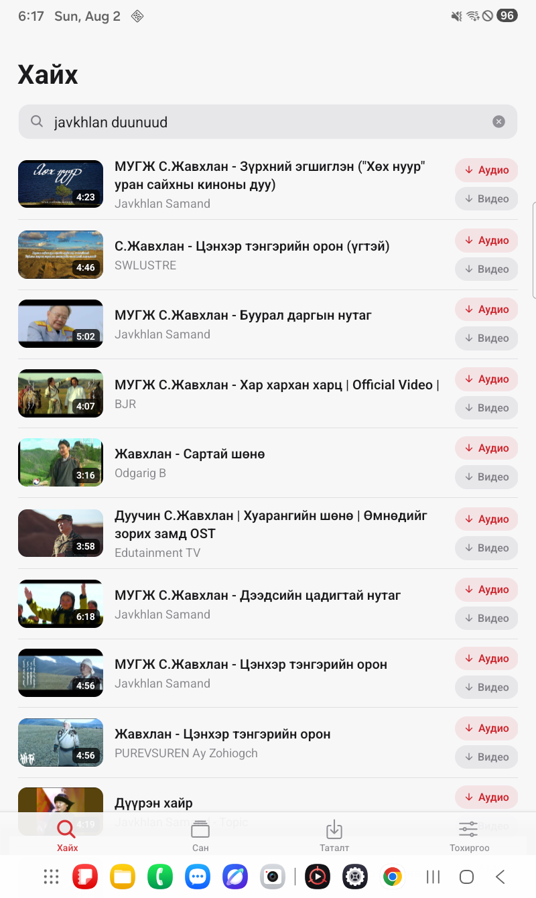
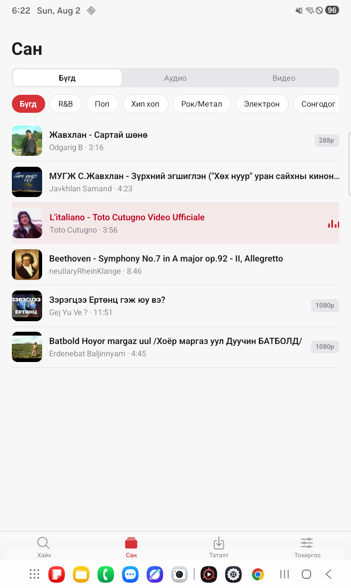
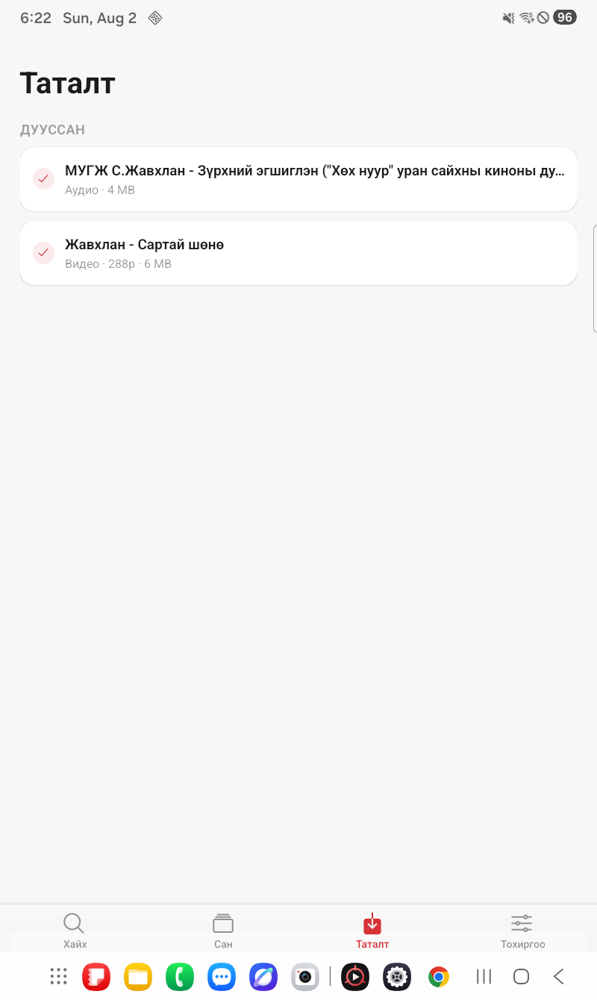
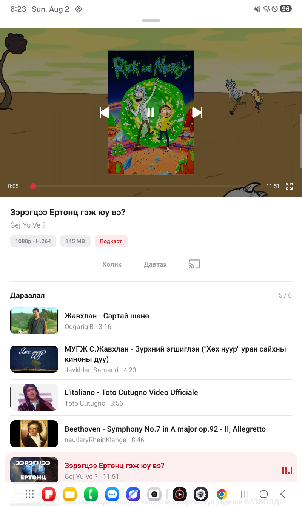
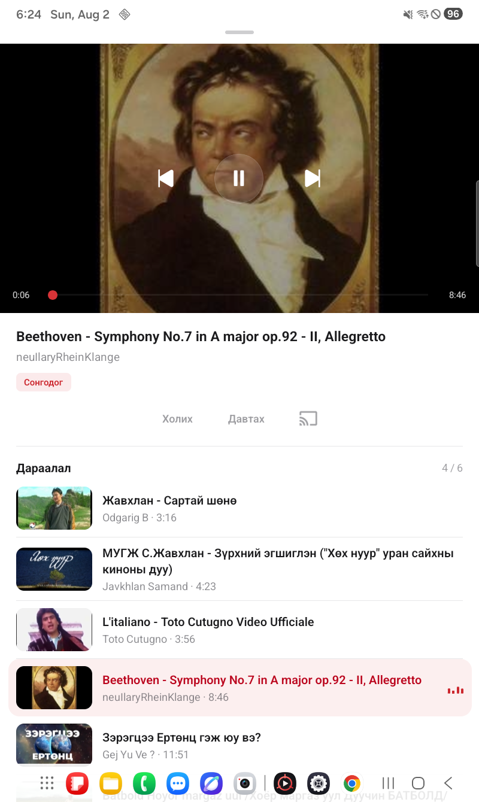
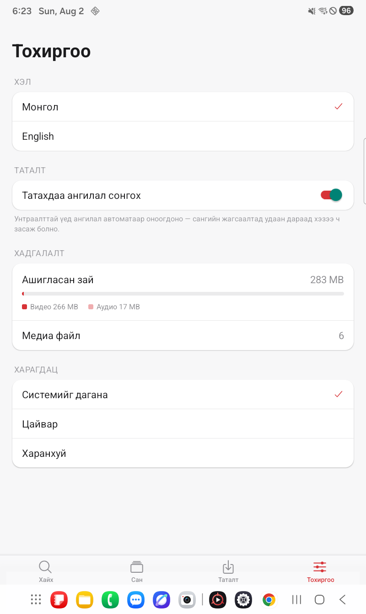

# TubeVault

Save YouTube audio and video to your Android phone. Play it back offline.

I built this because streaming eats data and Mongolian music is not on Spotify. The interface is in Mongolian and English.

Built with Expo SDK 57 and React Native 0.86.

## Screenshots

<p>
  
  
  
</p>
<p>
  
  
  
</p>

Top row: search, library, downloads. Below: video player, audio player, settings.

## What it does

* Search YouTube and get live suggestions while you type
* Save audio as m4a, or video as mp4 up to 1080p
* Sort your files into categories
* One queue that mixes audio and video, with shuffle and repeat
* Lock screen and notification controls
* Everything plays offline once it is on the device

## Requirements

* Node 20 or newer. Built and tested on 24.
* JDK 21. Anything older fails on the Android Gradle Plugin.
* Android SDK with platform tools and build tools installed
* A phone or emulator on Android 7 or newer

## Building a debug build

**1. Clone and install.**

```bash
git clone https://github.com/roriau0422/tubevault.git
cd tubevault
npm ci --legacy-peer-deps
```

`--legacy-peer-deps` is required, not a nicety. `expo-router` depends on `vaul`, which asks for `react-dom`, which this project does not install. Plain `npm ci` fails with ERESOLVE.

The `postinstall` hook runs `patch-package` on its own. That applies `patches/@nikhil-cephei+ffmpeg-kit-react-native+6.0.12.patch`, which is what makes ffmpeg compile under React Native 0.86. If you skip it the native build fails later with missing codegen output.

**2. Generate the native project.**

```bash
npx expo prebuild --platform android
```

The `android` folder is not in this repo. Expo writes it from `app.json` and the config plugin in `plugins/`. Read that before you hand edit anything inside `android`, because a later `prebuild --clean` deletes the whole folder.

**3. Point Gradle at your SDK.**

Skip this if `ANDROID_HOME` is already set. Otherwise Gradle stops with `SDK location not found`. Create `android/local.properties`:

```properties
sdk.dir=C\:\\Users\\you\\AppData\\Local\\Android\\Sdk
```

Use `/home/you/Android/Sdk` on Linux and `/Users/you/Library/Android/sdk` on macOS. Forward slashes are fine on those. On Windows the colon and the backslashes have to be escaped exactly as above.

**4. Run it.**

```bash
npx expo run:android
```

This installs a debug APK and starts Metro. The debug build loads JavaScript from Metro over the network, so it shows a red screen if the dev server goes away. It is not standalone.

## Building a release APK

A release build bundles JavaScript into the APK, runs R8, and needs a signing key. It runs with no Metro and no computer attached.

**1. Create a keystore.**

Put it in `certs/`, never in `android/`. That folder gets deleted by `prebuild --clean` and your key would go with it. `certs/` is already in `.gitignore`.

```bash
mkdir certs
keytool -genkeypair -v -storetype PKCS12 \
  -keystore certs/release.jks \
  -alias tubevault \
  -keyalg RSA -keysize 2048 -validity 10000
```

`keytool` ships with the JDK. It asks for a password and a name. Remember the password.

Keep this file. It is your app identity. Lose it and you can never update a published app, because Android refuses an update signed by a different key.

**2. Write the credentials into `certs/keystore.properties`.**

```properties
RELEASE_STORE_FILE=release.jks
RELEASE_KEY_ALIAS=tubevault
RELEASE_STORE_PASSWORD=the password you chose
RELEASE_KEY_PASSWORD=the password you chose
```

**3. Teach Gradle about the key.**

Open `android/app/build.gradle`. Inside `android { signingConfigs { ... } }`, next to the existing `debug` block, add:

```gradle
release {
    def props = new Properties()
    def propsFile = rootProject.file('../certs/keystore.properties')
    if (propsFile.exists()) {
        propsFile.withInputStream { props.load(it) }
        storeFile rootProject.file("../certs/${props['RELEASE_STORE_FILE']}")
        storePassword props['RELEASE_STORE_PASSWORD']
        keyAlias props['RELEASE_KEY_ALIAS']
        keyPassword props['RELEASE_KEY_PASSWORD']
    }
}
```

Then in `buildTypes { release { ... } }` replace `signingConfig signingConfigs.debug` with:

```gradle
signingConfig rootProject.file('../certs/keystore.properties').exists()
    ? signingConfigs.release
    : signingConfigs.debug
```

Expo generates `android` from scratch, so both of these edits are wiped by `prebuild --clean` and have to go back afterwards. Move them into a config plugin if you rebuild often.

**4. Give Lint more memory.**

In `android/gradle.properties`, raise the JVM arguments:

```properties
org.gradle.jvmargs=-Xmx4096m -XX:MaxMetaspaceSize=1536m
```

The default 512m of metaspace is not enough. Android Lint dies partway through the release build with `OutOfMemoryError: Metaspace` while parsing Kotlin inside `react-native-webview`. This edit is also lost on `prebuild --clean`.

**5. Build.**

```bash
cd android
./gradlew assembleRelease
```

Use `gradlew.bat assembleRelease` on Windows. Expect five to ten minutes on a cold build.

The APK lands at `android/app/build/outputs/apk/release/app-release.apk`.

**6. Check it is signed with your key, not the debug key.**

```bash
apksigner verify --print-certs android/app/build/outputs/apk/release/app-release.apk
```

`apksigner` sits in `$ANDROID_HOME/build-tools/<version>/`. The certificate DN it prints must be the name you typed in step 1. If it says `androiddebugkey`, step 3 did not take effect.

**7. Install.**

```bash
adb install android/app/build/outputs/apk/release/app-release.apk
```

A release APK cannot install on top of a debug one, because the signatures differ. Uninstall first if you have the debug build on the device, and understand that uninstalling erases every downloaded file with it.

The result is around 227 MB, because it carries native code for all four Android ABIs. Almost every real phone needs only `arm64_v8a`. Splitting per ABI cuts it to roughly a quarter.

## Building for iOS

Builds and runs on iOS. Downloading and playback both work. The steps below are the whole process, with nothing to patch by hand after `prebuild`.

`plugins/withTubeVaultNative.js` injects the ffmpeg pod into the Podfile for you, the ffmpeg patch carries the iOS changes it needs, and `UIBackgroundModes` is set so audio keeps playing in the background.

One thing worth knowing if you touch the download code: audio is saved as AAC rather than Opus on purpose. AVPlayer cannot decode Opus in an mp4 container and fails at playback with "Operation Stopped". See `src/services/formatPolicy.ts`.

You need a Mac. There is no way around it. Xcode only runs on macOS, and it is the only thing that can sign an iOS app.

### Requirements

* macOS with Xcode 26. That is what this was built on. Older Xcode may work and has not been tried.
* CocoaPods
* An Apple ID. A paid account is what I use. A free one works with the limits covered below.

### Steps

```bash
npm ci --legacy-peer-deps
npx expo prebuild --platform ios
cd ios && pod install
open TubeVault.xcworkspace
```

Open the workspace, not the project file. CocoaPods puts the dependencies in the workspace and an `xcodeproj` build will fail without them.

In Xcode, select the TubeVault target, then Signing and Capabilities:

1. Tick "Automatically manage signing".
2. Pick your team from the dropdown. A free Apple ID appears here as a personal team.
3. Change the bundle identifier. `com.temka.tubevault` is mine and Apple will reject it. Use something like `com.yourname.tubevault`.

Plug in your phone, select it as the run destination, and press Run. The first launch needs you to trust the certificate on the device under Settings, General, VPN and Device Management.

### Free Apple ID versus a paid account

A free Apple ID signs apps for your own device, with real limits:

* The provisioning profile expires after **7 days**. After that the app refuses to launch until you build it again from Xcode.
* Three sideloaded apps per device at a time.
* Ten app identifiers per week.
* No TestFlight and no ad hoc distribution, so you cannot hand the build to anyone else.

The Apple Developer Program at 99 USD a year lifts all of that. Profiles last a year, TestFlight takes up to 10000 external testers, and ad hoc builds cover 100 registered devices.

### Making an ipa for sideloading

Tools like AltStore and Sideloadly install an `ipa` from Windows or macOS. They do not build one. Something has to produce the file first, and that something is Xcode on a Mac.

With a paid account, use Product, then Archive, then Distribute App, and choose Ad Hoc or Development. You get an `ipa` that AltStore or Sideloadly can install.

With a free Apple ID you cannot export a usable `ipa`, because the export step needs distribution certificates a personal team does not get. Install straight to the device from Xcode instead, and repeat every 7 days.

If you have no Mac and no paid account, there is no supported path. A cloud macOS runner or a borrowed Mac is the realistic answer.

### The App Store

Do not plan on it. Apple rejects apps that download media from YouTube under App Review guideline 5.2.3, and it breaks YouTube's terms as well. This is for your own device, or TestFlight among people you know.

## How it works

### Two engines, one queue

Audio and video play through different libraries. Audio goes to `@rntp/player`, which gives you a real native queue plus lock screen controls. Video goes to `expo-video`. The app keeps a single queue in the UI and hands each item to whichever engine suits it. RNTP only ever receives the run of audio items around the current track, so stepping onto a video is handled in JavaScript.

That split is the source of most of the odd code in the player store. It is worth knowing before you change anything there.

### Search

Search hits YouTube's InnerTube API as the ANDROID_VR client. That client still hands back plain file URLs, which is the whole reason it is used.

It also matches queries literally. The logged in web client quietly expands a romanised query into Cyrillic. This one does not. Mongolian titles are written in Cyrillic, so `javkhlan duunuud` returned nothing at all, while `жавхлан дуунууд` returned a full page.

So when a literal search comes back empty, the app transliterates and tries again. Only when it comes back empty. `metallica` turns into `мэталлица` and still matches things, so rewriting every query would break the ones that already work.

Suggestions come from YouTube's public suggest endpoint. Passing `client=firefox` returns plain JSON instead of the JSONP wrapper the web player receives, which saves unwrapping it.

### Files

Downloads land in app private storage. Uninstalling the app deletes every file with it, so back anything up you care about.

Video gets remuxed with ffmpeg after download. YouTube serves fragmented DASH, and players read roughly double the real duration off it, which sends the scrubber sliding well past the end of the track.

## A note on dependencies

`@rntp/player` is free for personal use and needs a paid license for commercial use. See rntp.dev/pricing. If you plan to ship anything built on this, sort that out first.

## License

MIT. See [LICENSE](LICENSE).

Not affiliated with YouTube or Google. Downloading may run against YouTube's terms of service depending on where you are and what you download. Your call.
